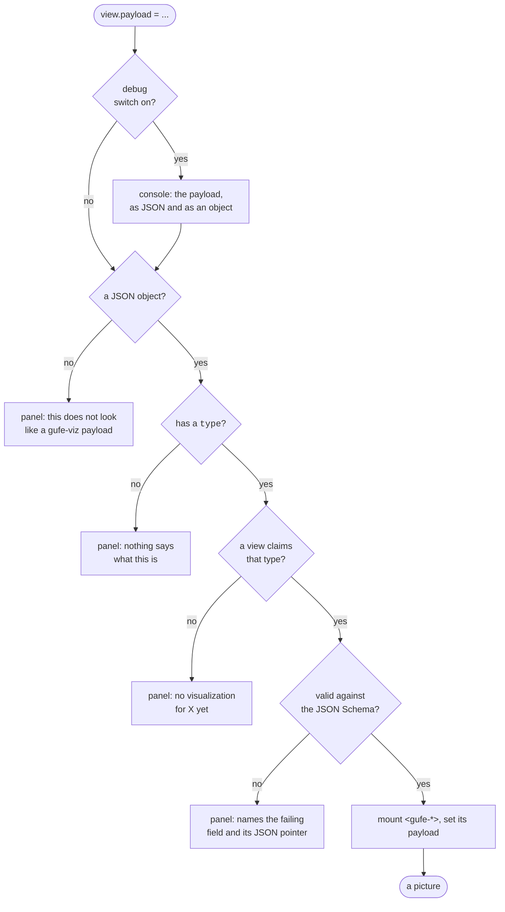
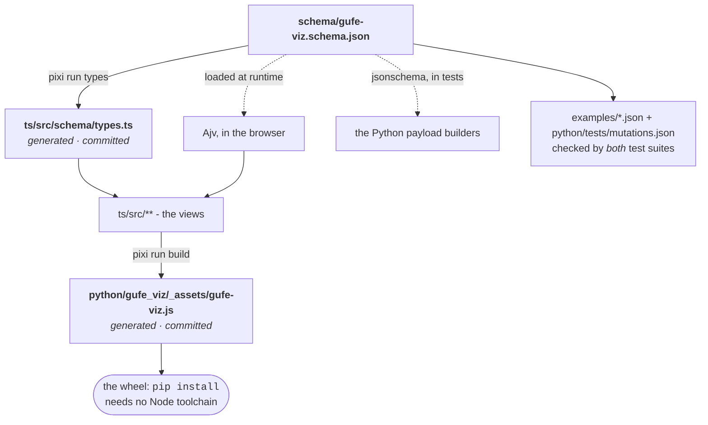

# gufe-viz

Visualization tools for [gufe](https://github.com/OpenFreeEnergy/gufe).

Turns a gufe object into an interactive browser visualization you open locally

> **Under construction.** The pipeline runs end to end, and three of the twelve
> payload types have a view. The rest are declared in the schema, built by
> Python, and render as "sorry, there is no visualization for X yet" until their
> views land. Nothing is published, so nothing here is stable yet.

---

## Quick start

### 1. Install pixi

**[pixi](https://pixi.sh) and git. That is the whole list.** pixi provides
everything else - Python 3.12+, Node 20+, gufe, RDKit, pytest, jsonschema and
ruff all come from `pixi.toml`, pinned in `pixi.lock`.

```bash
curl -fsSL https://pixi.sh/install.sh | bash    # macOS / Linux
brew install pixi                               # or Homebrew
```

The installer appends `~/.pixi/bin` to your shell profile. If you install with
`PIXI_NO_PATH_UPDATE=1` instead, nothing on `PATH` changes and every command
below needs the full `~/.pixi/bin/pixi` in place of `pixi`.

### 2. Get the environment

```bash
git clone https://github.com/omsf-eco-infra/gufe-viz.git
cd gufe-viz
pixi install
```

That solves and downloads a conda environment containing RDKit and gufe.

### 3. Look at the visualizations

Three ways:

**The gallery:**  every example payload on one page, for quick debugging and checks

```bash
pixi run dev
# http://localhost:5173/gallery.html
```

The gallery deliberately shows "sorry, there is no visualization for X yet" for
the types that have no view.

**Drag and drop:** the same dev server, one payload at a time. Drop any file
from `examples/` anywhere on the page:

```bash
pixi run dev
# http://localhost:5173/
```

**A standalone HTML file:** what is actually used by this library. One file, opened from disk, no server:

```bash
pixi run gufe-viz examples/ligand_network_named.json -o /tmp/network.html
open /tmp/network.html          # macOS;  xdg-open on Linux
```

With no `-o`, the page lands beside the input as `<input>.html`, so
`ligand.json` becomes `ligand.json.html`, keeping the original suffix so two
inputs that differ only by extension cannot collide. `-o -` writes to stdout.

The input may be one of our payload JSONs *or* a serialized gufe object; a gufe
object is deserialized into live Python objects first and turned into a payload
from there.

To see the payload the page was built from, render it with the debug switch
baked in:

```bash
pixi run gufe-viz-debug examples/ligand_network_named.json -o /tmp/network.html
```

### 4. Future CLI integration

Eventually `openfe` integration, but for now it's manual:

```python
import gufe_viz

html = gufe_viz.to_html(small_molecule_component)   # returns a string
open("mol.html", "w").write(html)                   # writing it is your call
```

`to_html` accepts a gufe object or a plain payload dict. It returns a string and
writes nothing.

### 5. Notebook rendering of visualizations

```python
gufe_viz.view(small_molecule_component)   # the same page, in a cell
```

**NB:** When this is published, we can update the gufe repo with this as an optional dependency, and if installed, will render the object without the need for specific `.view(..)` calls.


There are [two notebooks](examples/notebooks/), one is for running locally and the other is so you can see the visualization in e.g. github (which restricts javascript and iframes).

```bash
pixi run notebook    # JupyterLab on examples/notebooks/gufe-viz-demo.ipynb
pixi run marimo      # the same notebook, converted, in marimo
```

`gufe-viz-demo.ipynb` is the local **development** version, with every payload type. Make a change and refresh to iterate.

[`gufe-viz-gallery.ipynb`](examples/notebooks/gufe-viz-gallery.ipynb) is the
**GitHub** version, since GitHub's
notebook renderer strips the `<iframe>` and `<script>` that `view()` emits,
so you would see just blank cells instead of rendered visualizations.
`pixi run gallery` rebuilds the gallery images.

You can run the gallery: its cells hold the real `view()` call, and running
it replaces each screenshot with the live view. Just do not commit that: it
strips out the pictures GitHub needs. `pixi run gallery` puts them back.
[`examples/notebooks/README.md`](examples/notebooks/README.md) is the full note
for developers, including when to regenerate.

`view()` returns two layers from one call, and your frontend picks:

| layer | mimetype | needs | gives |
| --- | --- | --- | --- |
| static | `text/html` - the page in an `<iframe srcdoc>` | nothing | a saved notebook that still draws with no kernel |
| live | a widget view - shell page plus the payload as widget state | `anywidget` | `w.payload = other` redraws in place |

```python
w = gufe_viz.view(ligand_A)     # display it
w.payload = ligand_B            # the cell above redraws, in place

gufe_viz.view(obj, live=False)     # static only - what a kernel-less reader sees
gufe_viz.view(obj, static=False)   # live only - half the bytes, blank on export
```

The live layer is optional: `pip install gufe-viz[notebook]`. Without it `view()`
returns the static layer alone and everything still draws, minus the updating.

**Both layers put the view in an iframe**. We don't want any notebook css
interference, and the visualization must be a standalone page for the CLI
use case, so it's an iframe/page everywhere.

### What a *user* of the library needs

None of the above. Installing the package is plain pip, with no Node anywhere:

```bash
pip install .          # not on PyPI yet, see Status
```

The compiled JavaScript bundle is committed to this repository and ships inside
the wheel, which is what makes that true.

> **Get gufe from conda-forge, not PyPI.** The `gufe` on PyPI is stuck at 0.4, a
> single release predating the 1.0 API; conda-forge has 1.12.0, which is what
> this package is developed and tested against and what `pixi install` gives
> you. `conda install -c conda-forge gufe` is the other route.
>
> gufe is declared in **both** `pyproject.toml` and `pixi.toml`, which is not a
> duplication to tidy up. `pyproject.toml` is the only file pip can see, so the
> requirement has to live there; a PyPI requirement is satisfied by a conda
> package only when that package is also in pixi's own dependency table, so the
> entry in `pixi.toml` is what redirects it to conda-forge. Remove either one
> and something breaks.
>
> The `>=1.12` floor is what protects you: `pip install gufe-viz` fails with
> *"Could not find a version that satisfies the requirement gufe>=1.12 (from
> versions: 0.4)"* rather than quietly installing a gufe whose API is gone.
>
> `import gufe_viz` and `to_html(payload_dict)` need no gufe at all - the import
> is lazy - so `pip install --no-deps` is a valid way to get just the renderer.

---

## How the data flows

Python serializes a gufe object into a **schema-valid payload**; compiled
TypeScript custom elements ingest that payload and draw a picture. The JSON
Schema is the contract between the two, and it lives here, not in gufe.

```mermaid
flowchart LR
  subgraph PY["Python · python/gufe_viz"]
    direction TB
    obj["<b>gufe object</b><br/>SmallMoleculeComponent<br/>ProteinComponent<br/>LigandNetwork ..."]
    build["<b>payload_for()</b><br/>asks the object to serialize<br/><i>itself</i>: to_sdf(), to_pdb_file()"]
    plain["<b>a plain dict</b><br/>validated against the schema<br/>in the test suite"]
    obj --> build --> plain
  end

  plain --> payload[["<b>payload JSON</b><br/>flat, tagged with <code>type</code>"]]
  payload --> tohtml["<b>to_html()</b><br/>one self-contained page:<br/>bundle + payload + &lt;gufe-view&gt;"]

  subgraph BR["Browser · ts/src"]
    direction TB
    gview["<b>&lt;gufe-view&gt;</b><br/>validate, then dispatch on <code>type</code>"]
    view["<b>&lt;gufe-small-molecule&gt;</b><br/><b>&lt;gufe-protein&gt;</b><br/><b>&lt;gufe-ligand-network&gt;</b>"]
    gview --> view
  end

  tohtml --> gview
  view --> pic(["RDKit · 3Dmol · d3<br/>draw it"])
```



Two rules hold that picture together.

**gufe's own `to_json` never crosses into TypeScript.** TypeScript only ever
sees SDF, PDB and flat, schema-valid JSON, not even GraphML, whose nodes *are*
gufe JSON. Deduplicated key-chains, `:custom:` codecs and the `to_dict`/`to_json`
divergence all stay Python problems, because the alternative is a large amount
of TypeScript that has to track gufe's serialization forever.

**This package depends on gufe; gufe does not depend on this package.**

### The generated HTML file: what is in it, and how it loads

`to_html(obj)` returns a complete page as a **string** and writes nothing
anywhere. THen the CLI chooses where write it.
The page has four parts and no others:

```html
<gufe-view></gufe-view>                                <!-- 1. where it draws -->

<script id="gufe-payload" type="application/json">     <!-- 2. the data -->
{"type":"SmallMoleculeComponentViz","name":"benzene","sdf":"...", ... }
</script>

<script type="module">
  ... 239 kB of compiled bundle ...                        <!-- 3. the code -->

  document.querySelector("gufe-view").payload =        <!-- 4. the bootstrap -->
    JSON.parse(document.getElementById("gufe-payload").textContent);
</script>
```

**Where the input data lives:** inside the file, in `#gufe-payload`, as *inert
text*. `type="application/json"` is not a script type the browser executes, the
element is a container the DOM hands back as a string. Nothing fetches it,
nothing sits beside it on disk, and moving or emailing the `.html` moves the
data with it.

**How it is loaded:** by that last statement, run once at parse time.
`textContent` gets the raw JSON, `JSON.parse` turns it into an object, and
assigning it to `.payload` starts the render. That is the entire handshake: the
same custom-element API an external page or a notebook widget would use, and it
depends on no name the bundler chose. If anything throws, the message lands in a
visible `#gufe-error` strip at the top of the page rather than in a console
nobody has open.

**Why a JSON block rather than a JavaScript literal:** because the data is then
never parsed as code. The only byte sequence that could break out of the block
is `</script`, so every `</` in the payload is rewritten to `<\/` on the way in -
a legal JSON string escape, which means `JSON.parse` hands back exactly the
original characters. The bundle gets the same treatment on `</script` alone,
which in minified JavaScript only ever occurs inside a string or regex literal
where `<\/script` means the same thing. A molecule named
`</script><script>alert(1)</script>` is a test case here, not a hypothetical.

**Reading it by eye:** you cannot - it is one line, and a protein page's is
54 kB of it. Open the page as `<url>?debug` and the bundle prints it to the
console instead, indented. See [Debugging: seeing the
payload](#debugging-seeing-the-payload).

**Where the code comes from:** `python/gufe_viz/_assets/gufe-viz.js`, the
committed Vite build, read by `gufe_viz.bundle_source()` and inlined verbatim.
That file being in the repository and in the wheel is what lets `pip install`
work with no Node toolchain.

Typical sizes, dominated by the 239 kB bundle:

| Page | Payload | Whole file |
|---|---|---|
| benzene | 1.3 kB | 242 kB |
| a three-ligand network | 2.4 kB | 243 kB |
| a 40-residue protein fragment | 54 kB | 295 kB |
| whole 181L lysozyme | 217 kB | 458 kB |

**What is *not* in the file yet:** RDKit, 3Dmol and d3. A view fetches the one it
needs from a CDN on first use, so a page with no small molecule in it never
downloads RDKit's ~7 MB of WebAssembly. A planned `engines="bundled"` mode
inlines them through the same `globalThis.__gufeEngines` pre-seed hook the tests
use, for environments with no network access at all.

### What the browser does when a payload arrives

Setting `.payload` on a `<gufe-view>` is the whole API. Every failure below is a
panel that names the problem - never a thrown exception, and never a blank box.



The order matters. A `type` nobody ever declared is answered as "no
visualization for X" rather than as "does not match the schema" - the second is
true but useless. And validation runs against the *single* schema branch the
payload's `type` names, not the whole union, because the union only ever reports
"is not valid under any of the given schemas" at the root, while the branch
reports `/total_charge: must be number`.

There is no version check, because a payload carries no version field. Every
consumer ships the reader and the writer in one artifact - the generated page
inlines the exact bundle that reads it - so the two cannot be at different
versions. The version lives in the schema's `$id`.

Engines are loaded lazily and only when a view needs them: a protein page never
pays for RDKit's ~7 MB of WebAssembly, and a small-molecule page never pays for
d3.

### Debugging: seeing the payload

The payload is the contract between the two halves of this project, so the first
question about a page that draws the wrong thing - or nothing - is always *what
JSON did the browser actually get?* That is hard to answer by hand: in a
generated page it is one unbroken line inside `#gufe-payload`, and in a notebook
it never touches the DOM at all.

So the bundle will print it. Three switches turn that on, and any one of them is
enough:

| Switch | How | The case it exists for |
|---|---|---|
| URL | open the page as `<url>?debug` | a page **already written** - nothing is rebuilt, and `file:///tmp/network.html?debug` works |
| attribute | `to_html(obj, debug=True)`, `pixi run gufe-viz-debug <input>` | handing someone a file that does it on its own |
| global | `window.GUFE_VIZ_DEBUG = true`, set before `.payload` | a host that mounts the element itself: a notebook widget, or a console session |

`?gufe-debug` is accepted as well as `?debug`, for a host page that already uses
`?debug` for something of its own.

What lands in the console is one collapsed group per render:

```
> [gufe-viz] payload LigandNetworkViz (3542 chars)
    {
      "type": "LigandNetworkViz",
      "gufe-key": "LigandNetwork-fd4275a34f7e2c5b5021b5d9eb51d62d",
      "name": "",
      ...
    }
    > Object { type: "LigandNetworkViz", ... }
```

Both forms, because they answer different questions. The **text** is what to
copy into a file or a bug report, and it is exactly what the schema validator
saw. The **object** is the one the console lets you expand and click through.
The group is collapsed because a lysozyme page would otherwise put 217 kB of PDB
between you and the next message.

Two properties are worth relying on:

* **It logs before validation and before dispatch.** A payload that fails the
  schema, or names a type this build cannot draw, is still printed in full -
  which is the case the switch is for. The panel on the page tells you *which
  field*; the console tells you *what was actually there*.
* **It logs from `<gufe-view>`**, which every host goes through - the generated
  page, the dropzone, the gallery, and any embedding of the bundle. There is
  nothing to wire up per view.

Off, it costs one attribute read per render; `JSON.stringify` only ever runs when
it is on. So a page built without `debug=True` carries the capability at no cost
and answers to `?debug` for the rest of its life - which is why the URL switch,
not the build flag, is the one to reach for first.

The pieces are exported from the bundle for a host that wants to do its own
reporting, or to decide whether to:

```js
import { debugEnabled, logPayload, payloadJson } from "./gufe-viz.js";
```

---

## The contract: schema, sources and generated artifacts

### One file, two languages downstream

`schema/gufe-viz.schema.json` is **the source of truth.**
Both languages are downstream: TypeScript types are
generated from it, and Python validates against it in the test suite.



The schema is the source of truth and testing its correctness is what `mutations.json` is for.

Three artifacts are **generated and committed**: the TypeScript types, the
JavaScript bundle, and the example payloads. Committing the bundle is what lets
`pip install` work with no Node toolchain. `pixi run check-generated` rebuilds
all three and fails on any difference, so they cannot drift:

```bash
pixi run examples && pixi run types && pixi run build   # the fix, always
```

### The payload shape

There is no envelope. A payload is its `type`, its `gufe-key` and its own
fields, flat:

```json
{
  "type": "SmallMoleculeComponentViz",
  "gufe-key": "SmallMoleculeComponent-ec3c7a92...",
  "name": "benzene",
  "sdf": "...",
  "smiles": "c1ccccc1",
  "total_charge": 0
}
```

Anything that refers to another gufe object refers to it **by gufe key**, and
the objects themselves are carried once, in the `registry` on the root payload:

```json
{
  "type": "ChemicalSystemViz",
  "gufe-key": "ChemicalSystem-b51f409f...",
  "name": "benzene in water",
  "components": {
    "ligand":  "SmallMoleculeComponent-ec3c7a92...",
    "solvent": "SolventComponent-26b4034a..."
  },
  "registry": [
    { "type": "SmallMoleculeComponentViz", "gufe-key": "SmallMoleculeComponent-ec3c7a92...", "sdf": "..." },
    { "type": "SolventComponentViz",       "gufe-key": "SolventComponent-26b4034a...",       "smiles": "O" }
  ]
}
```

- **One schema object per gufe class.** Every `*Viz` is the visualization form
  of exactly one `GufeTokenizable`, and there is no second summary-only or
  reference-only variant of it anywhere. A ligand network's node, a mapping's
  endpoint and a standalone molecule are all the same
  `SmallMoleculeComponentViz`.
- **`gufe-key` on every object.** It is what the registry addresses an object
  by, and - being deterministic and repeatable within a software environment -
  it is also the identifier worth having in front of you when a payload does not
  draw.
- **A key always resolves to a whole object.** That is what makes drilling in
  possible: opening a network node gives you the ligand's SDF, opening an
  alchemical node gives you the protein's PDB.
- **The registry is the only deduplication mechanism.** An alchemical network
  whose forty systems share a protein carries that PDB once and points at it
  forty times. A payload is a single-shot dump with no server to ask, so the
  registry travels with it.
- **`type` is a closed discriminator.** A chemical-system view handed something
  else refuses it by name rather than guessing from which keys happen to be
  present.
- **`additionalProperties: false` everywhere**, so a typo in a payload builder
  is a validation error rather than a blank picture.
- The `Viz` suffix marks these as lossy visualization projections rather than
  gufe classes, so nobody expects a round trip.

All twelve types are declared even though three have views; declaring them up
front costs nothing and means adding a view is an additive change.

See [`schema/README.md`](./schema/README.md) for the full contract.

### What may cross the boundary

SDF, PDB, and flat plain JSON. That is the whole list.

GraphML is not on it. `LigandNetwork.to_graphml()` is a graph whose *node
payloads are gufe `to_json` moldicts*, so forwarding it does not avoid the
problem - it relocates it, and the browser still ends up decoding atomic
numbers, bond tuples and a base-1-per-char `.npy` conformer blob. A
`LigandNetworkViz` payload is a registry of ligands-as-SDF plus keyed topology
instead.

### How the two sides are kept honest

`examples/*.json` is the hinge. The same eleven golden payloads - built from real
gufe objects by `scripts/make_examples.py` - feed pytest, vitest, the
drag-and-drop page and the gallery. `python/tests/mutations.json` declares a mutation
matrix **once, as data**, and both suites apply it against the same schema file:
each row alters a payload in one specific way and pins what must happen.

Most rows must be rejected by both validators, at the same JSON pointer - a
rejection for the wrong reason does not count as a pass. A few must still be
*accepted*, and those matter just as much: garbage chemistry inside a valid
payload, a network edge naming a ligand that is not there, an unknown annotation
key. Schema validity is not chemical validity, and the views are what handle the
difference.

If the two validators ever disagree about what a valid payload is, one of the
two suites goes red.

---

## Developing and integrating

### Adding a view

The loop is short, and every step has a task:

1. **Model the data** in `schema/gufe-viz.schema.json`. Add a `$def`
   named exactly for the `type` const it declares - both validators find a
   payload's branch by that name.
2. **Build the payload** in `python/gufe_viz/components.py`, `networks.py` or
   `alchemical.py`, returning a plain dict, and add it to the `isinstance`
   dispatch. Ask the gufe object to serialize itself; never reach into its JSON.
3. `pixi run types` - the TypeScript types follow from the schema.
4. **Write the view**: `ts/src/views/<type>.ts`, a class extending
   `GufeElement<YourPayload>` with one `renderView(host, payload)` method.
   Return `{ onResize, cleanup }` if it owns anything that must be released.
5. **Register it**: add the tag to `VIEW_TAGS` in `ts/src/gufe-view.ts` and an
   `import` in `ts/src/index.ts`.
6. `pixi run examples` for a fixture, add the mutation rows that prove your new
   constraints hold, then `pixi run build` and `pixi run test`.

A parity test asserts that every type in `VIEW_TAGS` is one the schema declares.
The reverse is deliberately not required - a declared type with no view is the
"no visualization for X yet" panel, which is correct behaviour.

### The component model

Every view is a custom element with the same three-beat lifecycle, which is what
makes components reusable inside one another, and what will make the notebook
widget straightforward:

| Beat | Hook |
|---|---|
| create | `connectedCallback` - build the DOM, start engines |
| update | the `payload` setter - tear the old view down, build the new one |
| destroy | `disconnectedCallback` - kill viewers, observers and timers |

Embedding one view inside another is therefore
`host.appendChild(document.createElement("gufe-..."))`, and the embedded element
cleans itself up when its parent removes it. `<gufe-view>` itself is just a
dispatcher that does exactly this.

### Embedding the bundle in your own page

The bundle is one ES module. Importing it registers every element as a side
effect; there is no init call:

```html
<script type="module" src="gufe-viz.js"></script>
<gufe-view id="v" style="width:100%;height:600px"></gufe-view>
<script type="module">
  document.getElementById("v").payload = await (await fetch("payload.json")).json();
</script>
```

That handshake - put the element on the page, set `.payload` - is the entire
API. It is the same one
[the generated HTML file](#the-generated-html-file-what-is-in-it-and-how-it-loads)
uses, and the same one a notebook widget will use; only where the payload comes
from differs.

From Python, `gufe_viz.bundle_source()` returns the bundle as a string if you
want to inline it yourself rather than use `to_html`.

A host that mounts the element itself is the case `window.GUFE_VIZ_DEBUG = true`
exists for: set it before assigning `.payload` and the element prints what it was
handed. See [Debugging: seeing the
payload](#debugging-seeing-the-payload).

### Integrating with OpenFE

`gufe-viz <input>` exists as a working reference implementation, **not** as the
CLI integration - that is `openfe view`'s job when someone wires it up. The
library writes nothing to disk on its own; `to_html` returns a string and the
caller decides where it goes.

Which of gufe's serialization forms round-trips reliably is still an open
question: `QuickRun` writes `to_dict` while other paths write `to_json`, and the
keyed-chain form is different again. Rather than guess, the CLI tries the
documented entry point and, on failure, says so and names the two routes that
always work - a payload JSON, or building the object in Python and calling
`to_html` directly.

---

## Testing

```bash
pixi run test          # both suites - this is the one to run
```

That is `test-py` and `test-ts` together. Run them separately when iterating:

| Command | Suite | Covers |
|---|---|---|
| `pixi run test-py` | pytest | Payload builders per type; every fixture against the schema; the `isinstance` dispatch order against gufe's real class hierarchy; schema and TypeScript dispatch parity; the mutation matrix; `to_html` and the CLI. |
| `pixi run test-ts` | vitest | The same fixtures and the same mutation matrix through Ajv; `<gufe-view>` dispatch and graceful degradation; the create/update/destroy lifecycle; what each view puts on the page; the three debug switches and what they print; a smoke test that loads the **built bundle** and drives it through the generated page's bootstrap. |

Two more checks, both of which CI runs and both of which are easy to forget
locally:

```bash
pixi run lint              # ruff check + ruff format --check + tsc --noEmit
pixi run check-generated   # rebuilds examples, TS types and bundle; fails on any diff
```

All four at once, in CI's order:

```bash
pixi run ci
```

`check-generated` catches the most annoying class of mistake: change the schema
without regenerating the TypeScript types or the bundle, and everything passes
locally while CI goes red.

### Running a subset

```bash
pixi run pytest python/tests/test_mutations.py -q
pixi run pytest -k "mutation and protein" -v
pixi run npm run test -- validate           # vitest, by filename
pixi run npm run test:watch                 # vitest, watching
```

### No test reaches the network

RDKit, 3Dmol and d3 are faked through `globalThis.__gufeEngines` - the same
pre-seed hook a bundled-engines mode would use - so the tests exercise the real
loader path rather than a mock of it. Seeding d3 as something unusable is also
how the ligand network's offline fallback is tested, without a fetch that fails.

The suites stop at the engine boundary, though. They do not prove that RDKit
draws a molecule, that 3Dmol draws a protein, or that a force layout lands
somewhere sensible - for that, see
[Look at the visualizations](#3-look-at-the-visualizations).

---

## All tasks

| Task | What it does |
|---|---|
| `pixi run dev` | Vite dev server - dropzone and gallery |
| `pixi run gufe-viz <input> [-o out.html]` | Render one payload or gufe object as a standalone page |
| `pixi run gufe-viz-debug <input> [-o out.html]` | The same, with the payload printed to the browser console |
| `pixi run build` | Bundle TypeScript into `python/gufe_viz/_assets/gufe-viz.js` |
| `pixi run types` | Regenerate `ts/src/schema/types.ts` from the JSON Schema |
| `pixi run examples` | Rebuild `examples/*.json` from real gufe objects |
| `pixi run gallery` | Rebuild the gallery notebook - every view, screenshotted |
| `pixi run notebook` | JupyterLab on the demo notebook (its own environment) |
| `pixi run marimo` | The same notebook, converted, in marimo |
| `pixi run test-notebook` | The notebook layer's tests, with anywidget installed |
| `pixi run test` | Both test suites |
| `pixi run test-py` / `test-ts` | One suite each |
| `pixi run lint` | ruff, and `tsc --noEmit` |
| `pixi run format` | Apply ruff's fixes and formatting |
| `pixi run check-generated` | Fail if any committed generated artifact is stale |
| `pixi run ci` | Lint, both suites and `check-generated`, as CI runs them |

## Layout

```
schema/     the Python<->TypeScript contract, and the mutation matrix
python/     gufe_viz - payload builders, HTML writer, notebook view, CLI
ts/         the custom elements, one file per view
examples/   golden payloads, shared by pytest, vitest, the dropzone and the gallery
            notebooks/ - one demo covering every type and every delivery mode
scripts/    the generators, and CI runs
```

## Status

The pipeline works end to end. Nothing is published yet.

**Has a view:**

| Type | View |
|---|---|
| `SmallMoleculeComponentViz` | 2D depiction + 3D conformer |
| `ProteinComponentViz` | 3Dmol with representation and colour-scheme switchers |
| `LigandNetworkViz` | force / circular / radial graph, ligand depictions in the nodes, a detail pane per mapping |

**Declared, built by Python, no view yet:** `SolvatedPDBComponentViz`,
`ProteinMembraneComponentViz`, `SolventComponentViz`, `UnknownComponentViz`,
`LigandAtomMappingViz`, `ChemicalSystemViz`, `TransformationViz`,
`AlchemicalNetworkViz`.

**Not there yet:** the remaining views; zero-network pages with RDKit, 3Dmol and
d3 inlined (today's pages still fetch those three from their CDNs on demand);
the notebook widget; an optional localhost server; PyPI/conda-forge and the
transfer to the OpenFE org.

## Licence

MIT.
